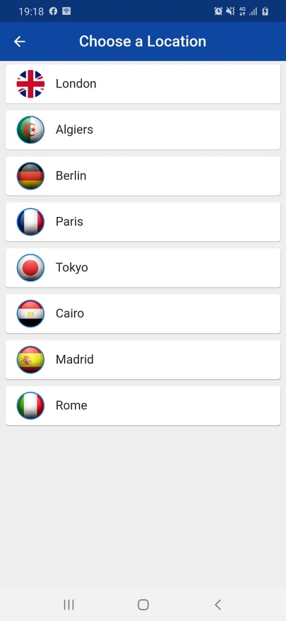
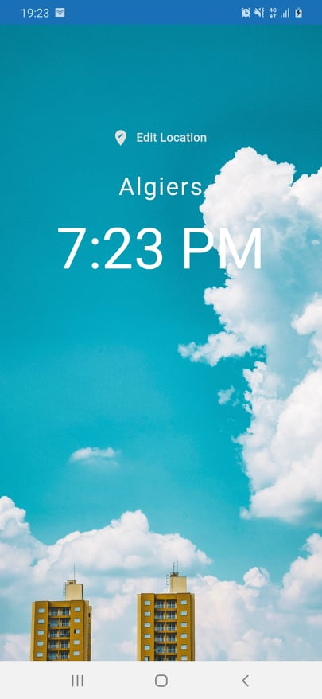
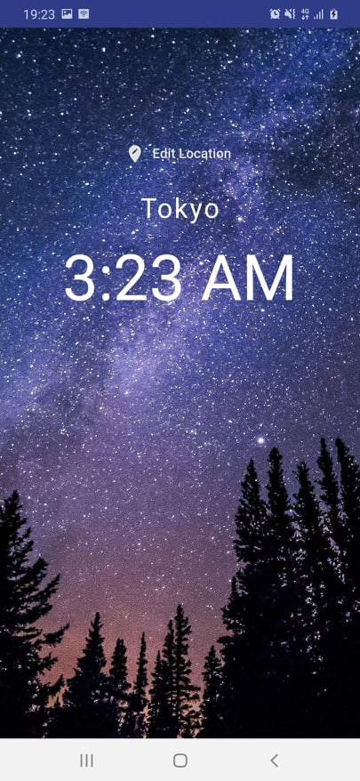

# World_Time-App

## Description

An app which shows the time over some countries capital, also the background-image changes depend on the time of the place you are selecting.

## Screenshots

  

## Tools & languages

* Flutter (Framework)
* Dart (Logic)
* Android Studio (Text Editor)

## Contribution

Feel free to fork this project and add whatever you like. If you have any suggestions or any comments please feel free to contact me or to open an issue.
